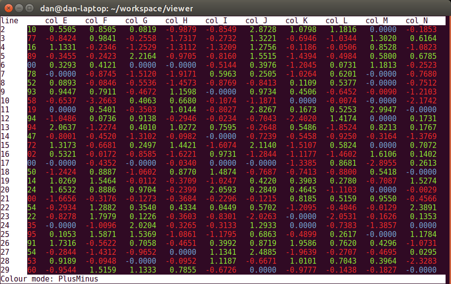

CSV Viewer
==========

Terminal CSV viewer with column alignment, scrolling, colour highlighting, and regex search. 
Uses ncurses to ensure the headers, and optionally line numbers, are always visible. Press 'h' for help.

Three colour modes
 * Off - Self explanitory
 * PlusMinus - Highlights positive numbers in green and negative in red
 * Scale - Applies the jet color map to each column _(requires 256 colour terminal)_

